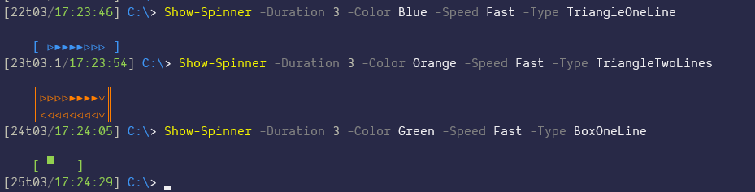
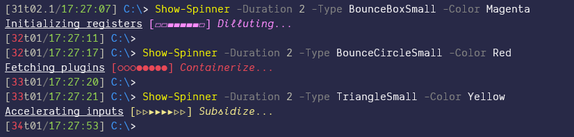
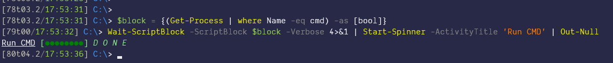

# PowerShell Infinite Progress Bar with Spinners

## Description

This module has the `Start-Spinner` function, which can be used to show an indefinite progress bar.
This is usually handy when you don't know when a task will finish and thus you don't have any indication of its progress.
<br>

And then it also provides the `Wait-Scriptblock` function which I've used in a number of occasions. So that would be useful on its own, but can also be combined with `Start-Spinner` to provide a nice console-friendly way to wait. See the last screenshot example. You can also see that in `\Docs\How to Use the Spinner.ps1`

## How to use it

The idea here is that a function will have either an object as its normal output, and perhaps some verbose output, which tells the end-user what is happening.
So on that basis, all you need to do is redirect that verbose and/or the warning output to the `Start-Spinner` function. 

And then the spinner with show up showing those verbose messages. The end effect is that the verbose output won't take multiple lines, but instead will be refreshed on that indefinite progress bar. Once your task completes, the spinner will stop.

Also as a best practice, it's good to say what is the main activity, so that it will be shown along with the spinner.

## Remarks

If there is an error while running your function, then `Start-Spinner` will show it on the console immediately. Which will break the spinner visual unfortunately. That means that even if you redirect everything to `Start-Spinner`, the errors won't be passed as messages to the progress status.
Alternatively if you want to collect the errors as part your output, then you can use the `-CollectErrors` switch which will do that.

## Example #1

```PowerShell
function Write-Something {
    [cmdletbinding()]
    param ()
    Write-Verbose 'vvv' ; sleep 1 ; Write-Output 'aaa' ; sleep 1 ; Write-Error 'eee' ; sleep 1
    Write-Verbose 'VVV' ; sleep 1 ; Write-Output 'bbb' ; sleep 1 ; Write-Error 'EEE' ; sleep 1
    [pscustomobject] @{Name = 'aaa' ; Size = 100}  # <-- normal output
}

$obj = Write-Something -Verbose *>&1 | Start-Spinner -Activity 'Doing Stuff' -CollectErrors
$obj  # <-- this will show the psobject as well as the errors

# or alternatively if you want to see the errors as they happen
$obj = Write-Something -Verbose *>&1 | Start-Spinner -Activity 'Doing Stuff' -Type DotsSmall
$obj # <-- this will only show the psobject, since the errors were shown during the spinner output
```

Other examples could be the installation of an application.
Since installs take a bit of time, this spinner will be handy to show that the process is not stuck.
<br/><br/>
So here's some screenshots while this runs:  

_Sample #1_ - Just a basic _Proof-Of-Concept_


_Sample #2_ - While using the _Show-Spinner_ which is more like a demo


_Wait example_ - Finally that's more like an actual example
